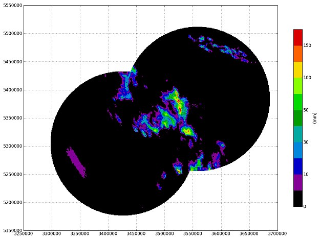
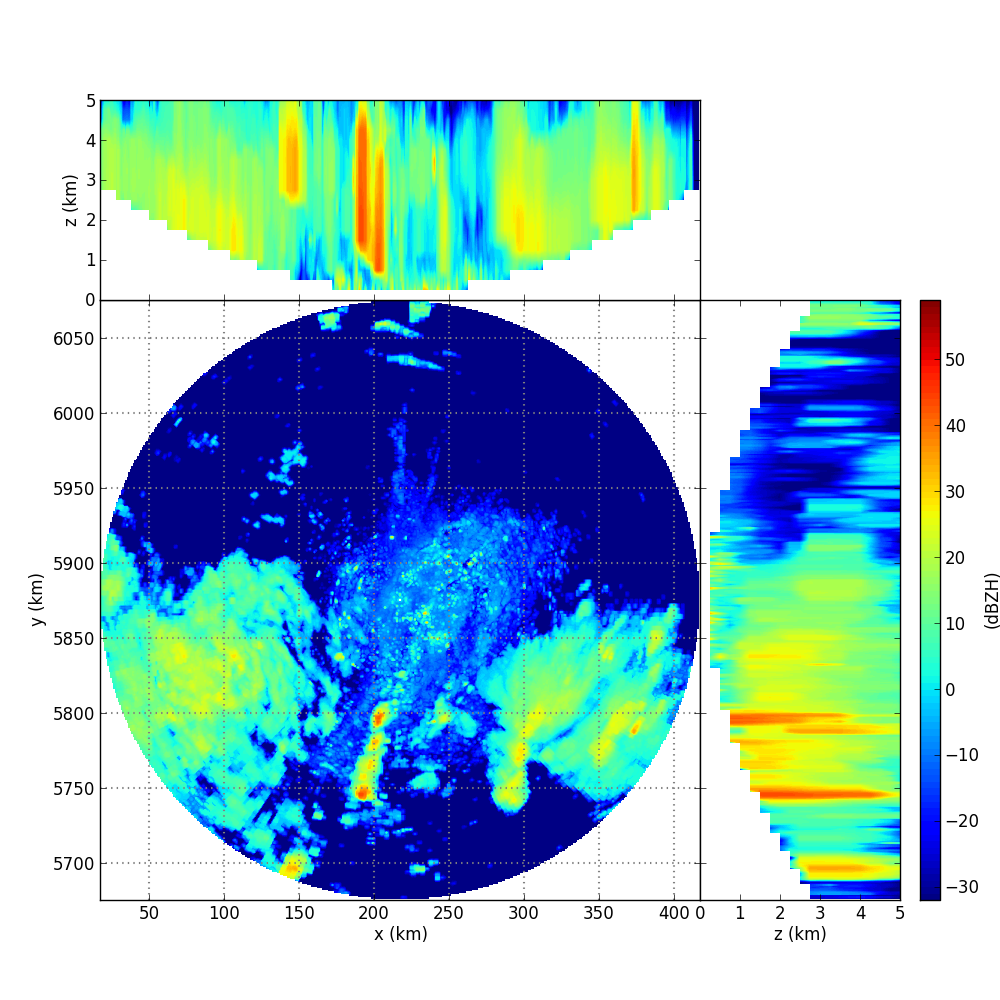

Recipes
=======

How can I publish my recipe here?
--------------------------------- 

This recipe section provides a collection of code snippets for exemplary wradlib applications. Compared to the :doc:`tutorials` section, the level of documentation is a bit lower. For each recipe, we provide a short summary and a link to the example code. 

Please feel to send us your recipes so we can include them on this page. Please send an e-mail to wradlib-dev@googlegroups.com containing:

- *optional*: name and affiliation

- a suggested title of the recipe

- a short decription of the recipe (max. 100 words)

- the recipe code (please add comments within the code!)

- *optional*: the data needed to run the code (or a hyperlink to the data)

- *optional*: some test output of the recipe (e.g. an image file)

Recipe #1: Clutter and attenuation correction plus composition for two DWD radars
---------------------------------------------------------------------------------

This recipe shows a workflow to process radar data provided by the German Weather Service (DWD). The processing includes: *(1)* Reading local :doc:`DX data <tutorial_supported_formats>` for radars Feldberg and Tuerkheim. *(2)* Clutter correction using the :doc:`Gabella filter algorithm <clutter>`. *(3)* Attenuation correction using the :doc:`Kraemer algorithm <atten>`. *(4)* Conversion from reflectivity to rainfall using the :doc:`zr` module. *(5)* Accumulation of rainfall depths over the entire event. *(6)* :doc:`Composition <comp>` of data from both radars to a common Cartesian grid (Gauss Krueger Zone 3). Composition is based on a weighted combination, using the sampling volume as a :doc:`quality criterion <qual>` *(7)* Plotting a rainfall map using :doc:`cartesian_plot <vis>`.

`Download source <http://bitbucket.org/wradlib/wradlib/src/default/examples/recipe1_clutter_attenuation_composition.py>`_

`Download required data <http://bitbucket.org/wradlib/wradlib/src/default/examples/data/recipe1_data.zip>`_

.. note:: In order to run the recipe code, you need to place the extract the sample data into a directory ``/recipe1_data/`` relative to the location of the recipe script. 

Recipe #2: Reading and visualizing an ODIM_H5 polar volume
----------------------------------------------------------

This recipe shows how extract the polar volume data from an ODIM_H5 hdf5 file (KNMI example file from OPERA), contruct a 3-dimensional Cartesian volume and produce a diagnostic plot. The challenge for this file is that for each elevation angle, the scan strategy is different.

`Download source <http://bitbucket.org/wradlib/wradlib/src/default/examples/recipe1_clutter_attenuation_composition.py>`_

`Download required data <http://bitbucket.org/wradlib/wradlib/src/default/examples/data/knmi_polar_volume.h5>`_

.. note:: In order to run the recipe code, you need to place the extract the sample data into a directory ``/recipe1_data/`` relative to the location of the recipe script. 

