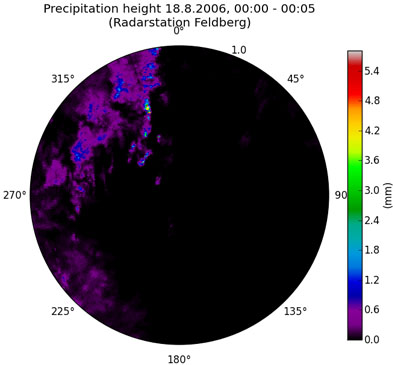
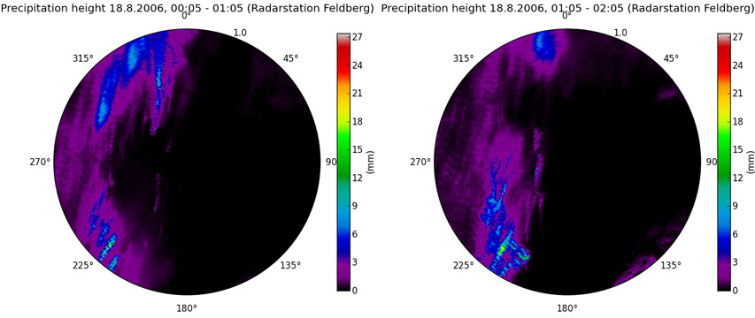
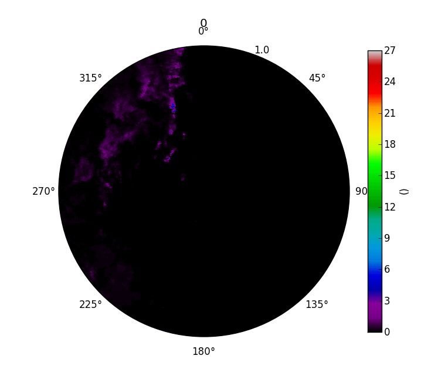

**********************************
Integration of precipitation rates
**********************************

Integrating precipitation rate of one radar scan over its corresponding time interval
-------------------------------------------------------------------------------------
For many purposes in hydrology you need data of the height of precipitation. For that reason we have to integrate the calculated precipitation rate over the timespan the accordant radar scan represents. In case of the radar stations of the German Weather Service the precipitation scan is repeated at intervals of 5 minutes (300 seconds)::

   import wradlib as wrl
   # set the location of your data
   datadir = 'D:/THIS/IS/MY/DATA/DIRECTORY/'
   data_dBZ = wrl.io.readDX(datadir + 'raa00-dx_10908-200608180005-fbg---bin')[0]
   data_R_rate = wrl.zr.z2r(wrl.trafo.idecibel(data_dBZ))
   data_R_height = wrl.trafo.r2depth(data_R_rate, 300.)
   wrl.vis.polar_plot(data_R_height, title = 'Precipitation height 18.8.2006, 00:00 - 00:05 (Radarstation Feldberg)',
       unit = 'mm', colormap = 'spectral')

Integrating and accumulating precipitation rates of several radar scans
-----------------------------------------------------------------------
To avoid reading each radar scan seperately, we first build an array of the timesteps we need, in order to scale the solution for longer time intervals. Suppose we want to accumulate the precipitation between 18.8.2006 00:05 and 18.8.2006 02:05::

   # the datetime library facilitates the work with timesteps
   import datetime as dt
   import numpy as np
   # begin and end of the accumulation interval stripped to a datetime format
   t_start = dt.datetime.strptime('2006-08-18 00:05:00', '%Y-%m-%d %H:%M:%S')
   t_end = dt.datetime.strptime('2006-08-18 02:05:00', '%Y-%m-%d %H:%M:%S')
   # empty list container for the resulting timesteps array
   times = []
   # temporal scan resolution in seconds as increment
   t_scan_res = 300.
   incr = dt.timedelta(seconds=t_scan_res)
   curtime = t_start
   while curtime <= t_end:
       times.append(curtime)
	   curtime = curtime + incr
   times = np.array(times)
   scans = times[:-1]
   
>>> print times
[2006-08-18 00:05:00 2006-08-18 00:10:00 2006-08-18 00:15:00
 2006-08-18 00:20:00 2006-08-18 00:25:00 2006-08-18 00:30:00
 2006-08-18 00:35:00 2006-08-18 00:40:00 2006-08-18 00:45:00
 2006-08-18 00:50:00 2006-08-18 00:55:00 2006-08-18 01:00:00
 2006-08-18 01:05:00 2006-08-18 01:10:00 2006-08-18 01:15:00
 2006-08-18 01:20:00 2006-08-18 01:25:00 2006-08-18 01:30:00
 2006-08-18 01:35:00 2006-08-18 01:40:00 2006-08-18 01:45:00
 2006-08-18 01:50:00 2006-08-18 01:55:00 2006-08-18 02:00:00]
   
We create an empty 3-dimensional array (time, azimuth, elevation) for all the radar data::

   data_dBZ = np.repeat(np.empty(46080), len(scans)).reshape(len(scans),360,128)

Now we can fill the empty array with radar data (:doc:`tutorial_reading_dx`)::

   for i,time in enumerate(scans):
       f = 'raa00-dx_10908-' + time.strftime('%Y%m%d%H%M') + '-fbg---bin'
       data_dBZ[i,:,:] = wrl.io.readDX(datadir + f)[0]

and proceed them to 5-minute-precipitation heights (:doc:`tutorial_reading_dx`, :doc:`tutorial_conversion`)::

   data_R_height = wrl.trafo.r2depth(wrl.zr.z2r(data_Z = wrl.trafo.idecibel(data_dBZ)), t_scan_res)

Before accumulating we finally have to build an array with the accumulated timesteps (e.g. hourly)::

   # list container for the array of accumulated time steps
   accum_times = []
   # accumulation interval (3600 = 1 hour)
   accum_interval = 3600.
   incr = dt.timedelta(seconds=accum_interval)
   curtime = t_start
   while curtime <= t_end:
       accum_times.append(curtime)
	   curtime = curtime + incr
   accum_times = np.array(accum_times)
   
Now we have everything we need for the accumulation::

   accum_data = wrl.util.aggregate_in_time(data_R_height, times, accum_times)
   wrl.vis.polar_plot(accum_data[0], title = 'Precipitation height 18.8.2006, 00:05-01:05 (Radarstation Feldberg)',
       unit = 'mm', colormap = 'spectral', vmax = max(accum_data))
   wrl.vis.polar_plot(accum_data[1], title = 'Precipitation height 18.8.2006, 01:05-02:05 (Radarstation Feldberg)',
       unit = 'mm', colormap = 'spectral', vmax = max(accum_data))
   

All raw data is provided by DWD