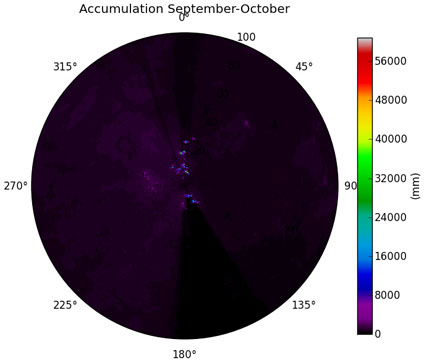
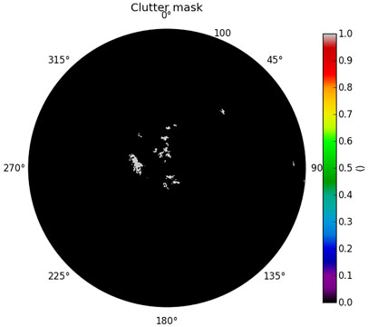
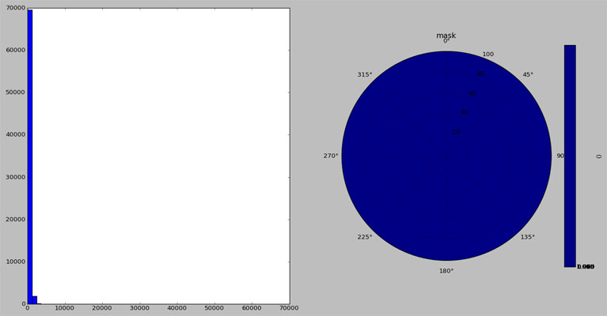
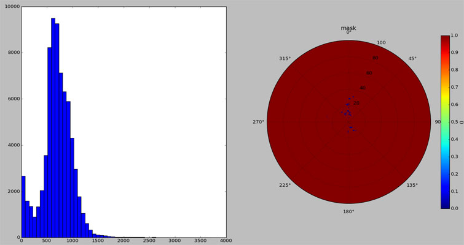
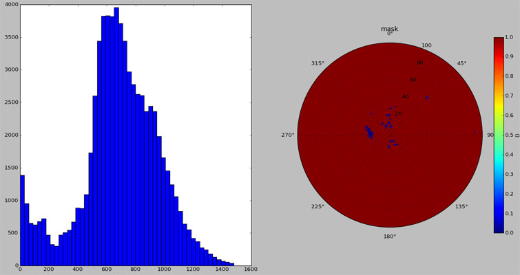
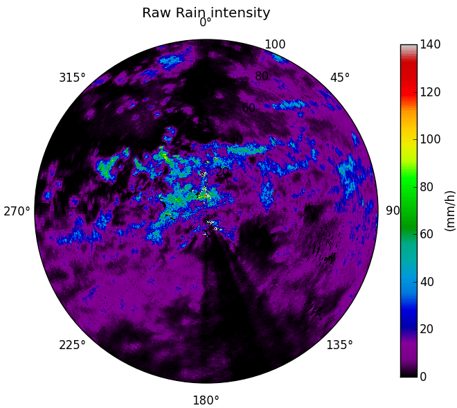

******************
Clutter correction
******************

Weather radar data with clutter (static and dynamic echos, not caused by precipitation) can be disastrously if used for hydrological rainfall-runoff modeling or related to attenuation correction of non-coherent radar data. So in most cases it is indispensable to detect and remove clutter bins from your radar data.

The wradlib function histo_cut is an histogram based clutter identification algorithm. It classifies an (preferential yearly based) precipitation accumulation of radar data into 50 classes and removes iteratively framing classes which undercut 1% of the class with the highest frequency.

In a first step you need an radar-image with an representative accumulation timespan, so that precipitation is distributed evenly over the image. As for example this philipinean image, where the scale extend shows us definitely the occurance of clutter:

With the accumulation data as an input histo_cut returns an mask array with ones where clutter is detected::

   import wradlib as wrl
   accumulation_array = np.loadtxt('d:/Stephan/Arbeit/PROGRESS/Daten/Philipines_s-band/netcdf/addition/prec_sum.txt')
   cluttermask = wrl.clutter.histo_cut(accumulation_array)
   

What happens behind the curtain is, histo_cut computes an histogram for all radar bins and the corresponding mask:

Seen from the class with the highest frequency histo_cut searches to the left and the right of the histogram for the nearest class wich underscores 1% of highest frequency class and cuts all values beyond these classes by setting them Nan.

As the result you see an histogram with a more narrow span of precipitation amounts and an updated clutter mask. This procedure is repeated iteratively until, the changes fall below a threshold value. The result are the final histogram and cluttermask:

Now the clutter bins should be substituted by some meaningful values derived by nearest neighbour or linear interpolation::

   # get the radar data which should be clutter corrected
   data, attrs = wrl.io.read_EDGE_netcdf('d:/Stephan/Arbeit/PROGRESS/Daten/Philipines_s-band/netcdf/20110927/SUB-20110927-050748-01-Z.nc', range_lim = 100000)

   # define clutter-indices on the basis of the clutter-mask
   clutter_indices = np.where(cluttermask.ravel())
   
   # compute bin centroid coordinates in cartesian map projection
   r = attrs['r'] / 1000.
   az = attrs['az']
   sitecoords = attrs['sitecoords'][0:-1]
   projstr = '+proj=utm +zone=51 +ellps=WGS84'
   binx, biny = wrl.georef.projected_bincoords_from_radarspecs(r, az, sitecoords, projstr)
   binx = binx.ravel()
   biny = biny.ravel()
   # coordinate pairs without clutter
   good_coordinates_list = np.array([(np.delete(binx,clutter_indices)), (np.delete(biny,clutter_indices))]).transpose()
   # list of the entire coordinate pairs from radarcircle
   trgcoord = np.array([binx, biny]).transpose()
   # building object class for nearest neighbour interpolation either for directly requested interpolation
   # by nearest neighbours or for filling the boundary gap caused by linear interpolation
   intpol_nearest = wrl.ipol.Nearest(good_coordinates_list, trgcoord)
   # building object class for linear interpolation
   intpol_linear = wrl.ipol.Linear(good_coordinates_list, trgcoord)
   # substitute clutter by interpolation methods
   # Conversion from dBZ to rainintensity
   rain_intensity = wrl.zr.z2r(wrl.trafo.idecibel(data)).ravel()
   # Substitute Nan
   rain_intensity = np.where(np.isnan(rain_intensity), 0, rain_intensity )
   # rain intensity data without clutter
   values_list = np.delete(rain_intensity,clutter_indices)
   # spatial interpolation of rain intensity for the whole radar scan based on the data without clutter
   filled_R = intpol_nearest(values_list).reshape(len(attrs['az']), len(attrs['r']))
   # calculating nearest neighbour interpolation if requested and filling possible boundary gaps
   filled_R_linear = intpol_linear(values_list).reshape(len(attrs['az']),len(attrs['r']))
   filled_R = np.where(np.isnan(filled_R_linear), filled_R, filled_R_linear)
   rain_intensity = rain_intensity.reshape(len(attrs['az']), len(attrs['r']))
   wrl.vis.polar_plot(rain_intensity, title = 'Rain intensity', unit = 'mm/h',
       R = attrs['max_range'] / 1000., colormap = 'spectral', vmax = 140.)
   wrl.vis.polar_plot(filled_R, title = 'Clutter corrected rain intensity',
       unit = 'mm/h', R = attrs['max_range'] / 1000., colormap = 'spectral', vmax = 140.)
   
As the result you will see the original rain intensity (left) and the image with clutter correction (right)

