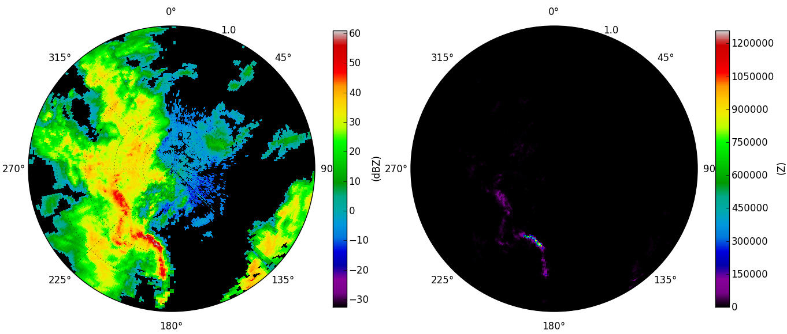
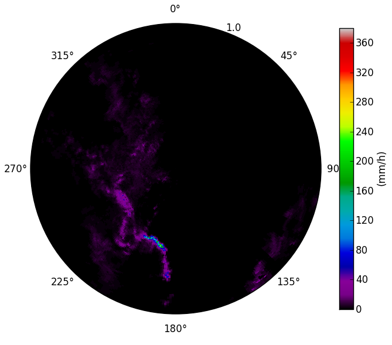
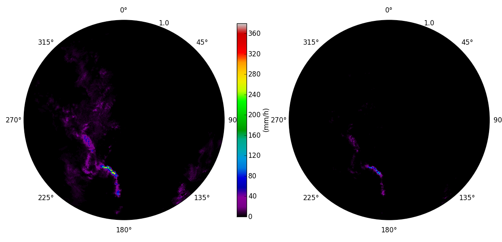
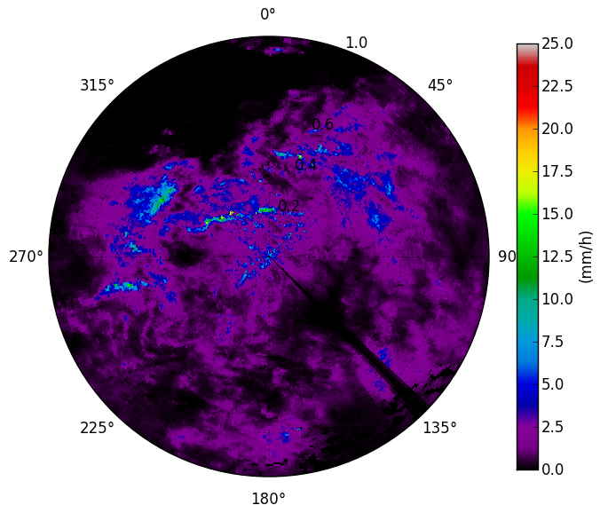

*************************
Converting reflectivities
*************************

Reflectivity (Z) and precipitation rate (R) can be related in form of a power law R=a*Z**b. The parameters a and b depend on the type of precipitation.

Because the ZR-relationship is based on reflectivities in Z and the encoded radar data is given in dBZ we have to take the antilogarithm of the dBZ-values::

   import wradlib as wrl
   data = wrl.io.readDX('p:/progress/test/raa00-dx_10908-200608180225-fbg---bin')
   data_dBZ = wrl.trafo.rvp2dBZ(data)
   data_Z = wrl.trafo.idecibel(data_dBZ)
   
After taking the antilogarithm the scale of low precipitation rates appears distinctly more squeezed

>>> wrl.vis.polar_plot(data_dBZ, unit = 'dBZ', colormap = 'spectral')
>>> wrl.vis.polar_plot(data_Z, unit = 'Z', colormap = 'spectral')

   
Converting reflectivities to precipitation rates
------------------------------------------------

Now we convert the reflectivities to precipitation rates::

   data_Rc-c = wrl.zr.z2r(data_Z, a = 200., b = 1.6)
   wrl.vis.polar_plot(data_Rc-c, unit = 'mm/h', colormap = 'spectral')

The structure of precipitation cells is indicating a convective precipitation type. 

We try out what happens, if we convert the same reflectivity scan based on a ZR-relation with parameters for stratiform precipitation (below left) and look for the difference (below right)::

   data_Rc-s = wrl.zr.z2r(data_Z, a = 256., b = 1.42)
   dif = data_Rc-s - data_Rc-c
   wrl.vis.polar_plot(data_Rc-s, unit = 'mm/h', colormap = 'spectral')
   wrl.vis.polar_plot(dif, unit = 'mm/h', colormap = 'spectral')
   
The precipitation rates are punctual significantly overestimated by 20-120 mm/h. 

That is because the reflecting signal of a rain drop with a diameter of 5mm (heavy precipitation) is equal to about 15000 raindrops (light precipitation) with a diameter of 1mm. At which the latter are weighing more than 100 times of the first one. 

Given that in flash flood forecasting an overestimation of convective rainstorms is more critical (false alarm) than an underestimation of light precipitation, the default is set to the convective type of rain. If we know the precipitation type exactly, the corresponding Z-R-parameters should be applicated of course.

Now we should examine what happens, if we convert a stratiform precipitation with parameters for convective precipitation::

   data = wrl.io.readDX('p:/progress/test/raa00-dx_10908-200608281420-fbg---bin')
   data_dBZ = wrl.trafo.rvp2dBZ(data)
   data_Z = wrl.trafo.idecibel(data_dBZ)
   data_Rs-s = wrl.zr.z2r(data_Z, a = 256., b = 1.42)
   data_Rs-c = wrl.zr.z2r(data_Z)
   dif = data_Rs-s - data_Rs-c
   wrl.vis.polar_plot(data_Rs-s, unit = 'mm/h', colormap = 'spectral')
   wrl.vis.polar_plot(data_Rs-c, unit = 'mm/h', colormap = 'spectral')
   wrl.vis.polar_plot(dif, unit = 'mm/h', colormap = 'spectral')

.. image:: images/s_dif.png

Consistently the conversion image with the wrongly supposed convective Z-R-parameters (lower left) underestimates the supposeable more precisely conversion with stratiform Z-R-parameters. But the underestimation isn't exceeding values of more than 4 mm/h, which is quite acceptable.

All raw data is provided by DWD