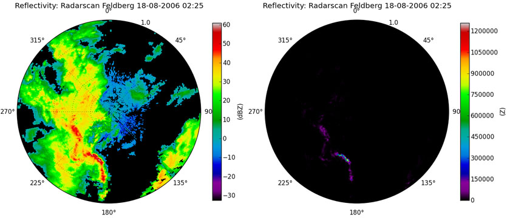
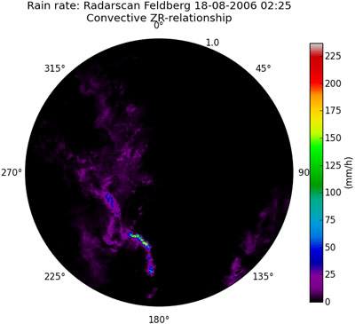
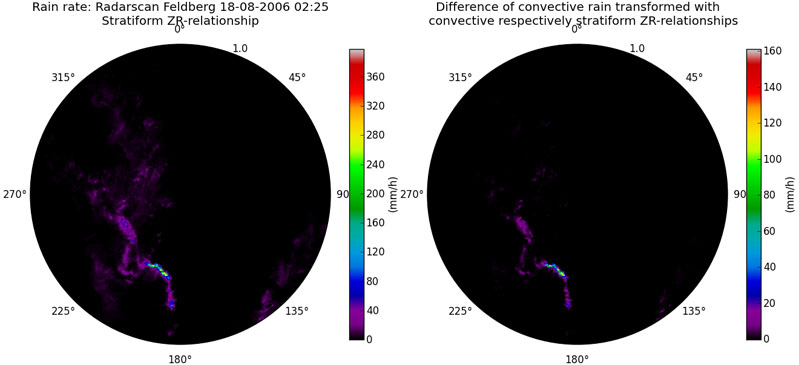
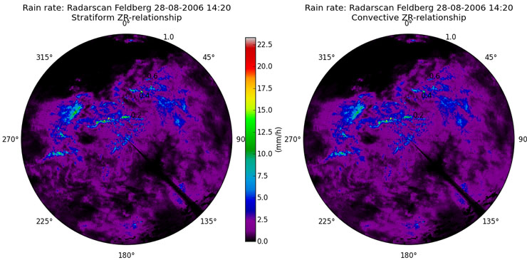
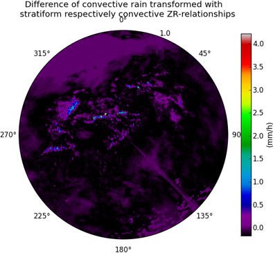

*************************
Converting reflectivities
*************************

Reflectivity (Z) and precipitation rate (R) can be related in form of a power law R=a*Z**b. The parameters a and b depend on the type of precipitation (i.e. drop size distribution and water temperature).

Because the ZR-relationship is based on reflectivities in Z and the encoded radar data is given in dBZ we have to take the antilogarithm of the dBZ-values after reading the DX-data (:doc:`tutorial_reading_dx`)::

   import wradlib as wrl
   # set the location of your data
   datadir = 'D:/THIS/IS/MY/DATA/DIRECTORY/'
   data_dBZ = wrl.io.readDX(datadir + 'raa00-dx_10908-200608180225-fbg---bin')[0]
   data_Z = wrl.trafo.idecibel(data_dBZ)
   
After taking the antilogarithm the scale of low precipitation rates appears distinctly more squeezed::

   wrl.vis.polar_plot(data_dBZ, title = 'Reflectivity: Radarscan Feldberg 18-08-2006 02:25',
       unit = 'dBZ', colormap = 'spectral')
   wrl.vis.polar_plot(data_Z, title = 'Reflectivity: Radarscan Feldberg 18-08-2006 02:25',
       unit = 'Z', colormap = 'spectral')

   
Converting reflectivities to precipitation rates
------------------------------------------------

Now we convert the reflectivities to precipitation rates. As we see in the previous image the reflectivities reach values of about 60 dBZ. This and the structure of the precipitation cells is indicating a convective precipitation type. That's why we will use the Marshall-Palmer ZR-relationship with parameters of a=200 and b=1.6. Since that are the default settings for the z2r-function, we don't have to assign additional parameters::

   data_Rc_c = wrl.zr.z2r(data_Z)
   wrl.vis.polar_plot(data_Rc_c, title = 'Rain rate: Radarscan Feldberg 18-08-2006 02:25\nConvective ZR-relationship',
       unit = 'mm/h', colormap = 'spectral')

The structure of precipitation cells is indicating a convective precipitation type. 

We try out what happens, if we convert the same reflectivity scan based on a ZR-relation with parameters for stratiform precipitation (below left) and look for the difference (below right) between both results::

   data_Rc_s = wrl.zr.z2r(data_Z, a = 256., b = 1.42)
   dif = data_Rc_s - data_Rc_c
   wrl.vis.polar_plot(data_Rc_s, title = 'Rain rate: Radarscan Feldberg 18-08-2006 02:25\nStratiform ZR-relationship',
       unit = 'mm/h', colormap = 'spectral')
   wrl.vis.polar_plot(dif, title = '''Difference of convective rain transformed with
       convective respectively stratiform ZR-relationships''', unit = 'mm/h', colormap = 'spectral')

At first view the results of the convective and the stratiform ZR-relationsship look very similar, but take the scalebar into account. That explains the differnce in the right image, where you can observe punctual overestimations up to 160 mm/h. 

That is because the reflecting signal of a rain drop with a diameter of 5mm (heavy precipitation) is equal to about 15000 raindrops (light precipitation) with a diameter of 1mm. At which the latter are weighing more than 100 times of the first one. 

Given that in flash flood forecasting an overestimation of convective rainstorms is more critical (false alarm) than an underestimation of light precipitation, the default is set to the convective type of rain. If we know the precipitation type exactly, the corresponding ZR-parameters should be applicated of course.

Now we should examine what happens, if we convert a stratiform precipitation event with ZR-relationsships for stratiform respectively convective precipitation. In this case we use the same scale extends::

   data_dBZ = wrl.io.readDX(datadir + 'raa00-dx_10908-200608281420-fbg---bin')[0]
   data_Z = wrl.trafo.idecibel(data_dBZ)
   data_Rs_s = wrl.zr.z2r(data_Z, a = 256., b = 1.42)
   data_Rs_c = wrl.zr.z2r(data_Z)
   max_data = max(data_Rs_s.max(), data_Rs_c.max())
   dif = data_Rs_s - data_Rs_c
   wrl.vis.polar_plot(data_Rs_s, title = 'Rain rate: Radarscan Feldberg 28-08-2006 14:20\nStratiform ZR-relationship',
       unit = 'mm/h', colormap = 'spectral', vmax = max_data)
   wrl.vis.polar_plot(data_Rs_c, title = 'Rain rate: Radarscan Feldberg 28-08-2006 14:20\nConvective ZR-relationship',
       unit = 'mm/h', colormap = 'spectral', vmax = max_data)
   wrl.vis.polar_plot(dif, title = '''Difference of convective rain transformed with
       stratiform respectively convective ZR-relationships''', unit = 'mm/h', colormap = 'spectral')

Consistently the conversion image with the wrongly supposed convective ZR-parameters (upper right) underestimates the supposeable more precisely conversion with stratiform ZR-parameters (upper left). But the underestimation isn't exceeding values of more than 4.2 mm/h, which is quite acceptable.

All raw data is provided by DWD