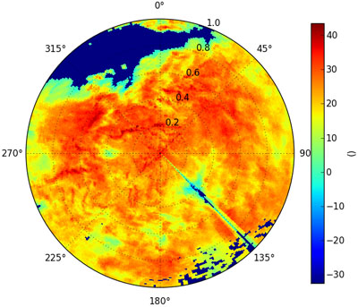
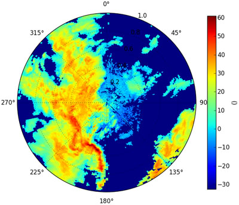
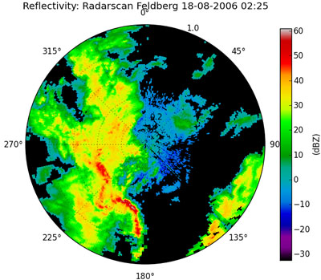
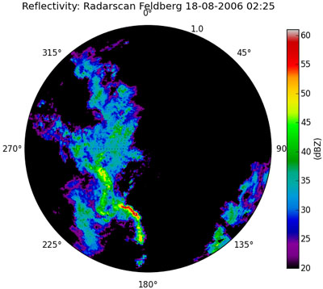
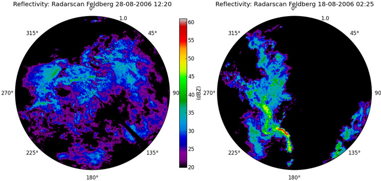

********************************
Read and plot raw DWD radar data
********************************

This tutorial helps you to read the raw radar data as provided by German Weather Service (DWD), to transform the data to dBZ values and to plot the results.

Reading DX-data
---------------

First step we often have to do for weather radar data processing is to decode the data from their binary raw format. The German weather service provides its radar data as so called DX-data. These have to be unpacked and transfered into an array of 360 (angular values in resolution of 1 degree) by 128 (range values in resolution of 1 km).

The naming convention for dx-data is: raa00-dx_<location-id>-<YYMMDDHHMM>-<location-abreviation>---bin or raa00-dx_<location-id>-<YYYYMMDDHHMM>-<location-abreviation>---bin. For example: raa00-dx_10908-200608281420-fbg---bin raw data from radar station Feldberg (fbg, 10908) from 28.8.2006 14:20.

The DX-file contains also additional information like elevation angles and azimuths.

**Raw data for one time step**

Suppose we want to read a radar-scan for a defined time step::

   import wradlib as wrl
   # set the location of your data
   datadir = 'D:/THIS/IS/MY/DATA/DIRECTORY/'
   singular_data, attributes = wrl.io.readDX(datadir + 'raa00-dx_10908-200608281420-fbg---bin')
   
Since the readDX function returns two variables, the scan values and the elevation/azimuth information, the function is assigned to two variables.

**Raw data for multiple time steps**

First we should create an empty array with the shape of the desired dimensions. In this example, the dataset contains 2 timesteps of 360 by 128 values. Since we don't need the attribute information the function call is indexed just for the first variable.::

   import numpy as np
   multiple_data = np.empty((2,360,128))
   multiple_data[0] = wrl.io.readDX(datadir + 'raa00-dx_10908-200608180225-fbg---bin')[0]
   multiple_data[1] = wrl.io.readDX(datadir + 'raa00-dx_10908-200608180230-fbg---bin')[0]
   

Visualizing dBZ values
----------------------

Now we want to plot the results of the sinular scan in a polar plot.

The quick solution::

   wrl.vis.polar_plot(singular_data)
   
we see a typical stratiform precipitation:
   

with two shielding effects, the foothills of the Alps and unfortunately a spike caused by a television tower nearby the radar antenna.

As another image visualization::

   wrl.vis.polar_plot(multiple_data[0])
   
typical convective precipitation cells:
   

We can add little adornment like a title, units and a spectral colormap for better identifiability of values::

   wrl.vis.polar_plot(multiple_data[0], title = 'Reflectivity: Radarscan Feldberg 18-08-2006 02:25',
       unit = 'dBZ', colormap = 'spectral')

   
Usually we talk about rain, when reflectivities exceed 20 dBZ (corresponding to a precipitation of 0.6 mm/h), thus we set the lower end of the colormap to an value of 20 dBZ for masking the wet noise::

   wrl.vis.polar_plot(multiple_data[0], title = 'Reflectivity: Radarscan Feldberg 18-08-2006 02:25',
       unit = 'dBZ', colormap = 'spectral', vmin = 20)

   
And for a better comparison of the stratiform and the convective precipitation we fix the upper end of the colormap to the maximum value of the datasets::

   max_data = max(singular_data.max(), multiple_data[0].max())
   wrl.vis.polar_plot(singular_data, title = 'Reflectivity: Radarscan Feldberg 28-08-2006 14:20',
       unit = 'dBZ', colormap = 'spectral', vmin = 20, vmax = max_data)
   wrl.vis.polar_plot(multiple_data[0], title = 'Reflectivity: Radarscan Feldberg 18-08-2006 02:25',
       unit = 'dBZ', colormap = 'spectral', vmin = 20, vmax = max_data)

All raw data is provided by DWD