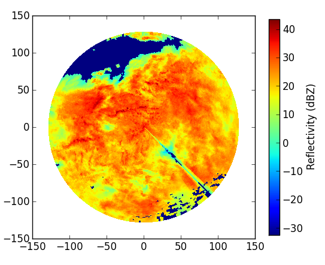
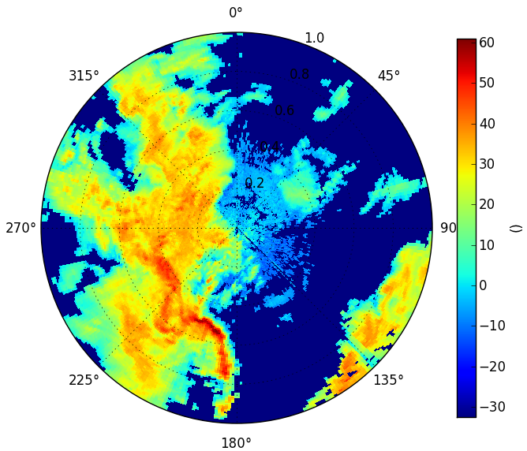
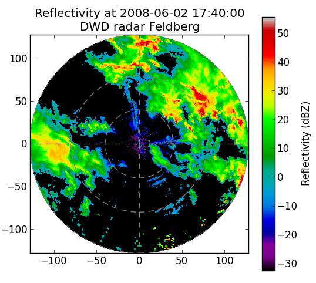
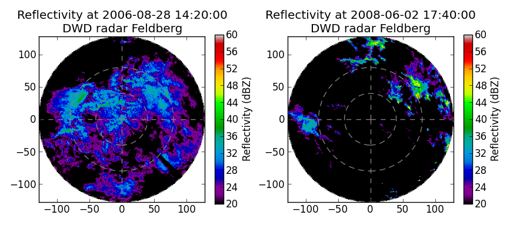

************************************
Read and plot DX radar data from DWD
************************************

This tutorial helps you to read and plot the raw polar radar data provided by German Weather Service (DWD).

Reading DX-data
---------------

The German weather service provides polar radar data in the so called ``DX`` format. 
These have to be unpacked and transfered into an array of 360 (azimuthal resolution of 1 degree) by 128 (range resolution of 1 km).

The naming convention for DX data is: 
``raa00-dx_<location-id>-<YYMMDDHHMM>-<location-abreviation>---bin`` or ``raa00-dx_<location-id>-<YYYYMMDDHHMM>-<location-abreviation>---bin``. 
For example: ``raa00-dx_10908-200608281420-fbg---bin`` raw data from radar station Feldberg (fbg, 10908) from 2006-08-28 14:20:00.

Each DX file also contains additional information like the elevation angle for each beam. Note, however, that the format is not "self-describing".

**Raw data for one time step**

Suppose we want to read a radar-scan for a defined time step. 
You need to make sure that the data file is available in the current working directory::

   import wradlib
   one_scan, attributes = wradlib.io.readDX('raa00-dx_10908-200608281420-fbg---bin')
   
The readDX function returns two variables: the reflectivity array, and a dictionary of metadata attributes.

**Raw data for multiple time steps**

To read multiple scans into one array, you should create an empty array with the shape of the desired dimensions. 
In this example, the dataset contains 2 timesteps of 360 by 128 values. Note that we simply catch the metadata dictionary
in a dummy variable::

   import numpy as np
   two_scans = np.empty((2,360,128))
   two_scans[0], _ = wradlib.io.readDX('raa00-dx_10908-0806021740-fbg---bin')
   two_scans[1], _ = wradlib.io.readDX('raa00-dx_10908-0806021745-fbg---bin')
   

Visualizing dBZ values
----------------------

Now we want to create a quick diagnostic PPI plot of reflectivity in a polar coordiate system::

   ax, pm = wradlib.vis.plot_ppi(one_scan)
   # add a colorbar with label
   cbar = plt.colorbar(pm, shrink=0.75)
   cbar.set_label("Reflectivity (dBZ)")
   
This is a stratiform event. Apparently, the radar system has already masked the foothills of the Alps as clutter. 
The spike in the south-western sector is caused by a broadcasting tower nearby the radar antenna.
   

Another image shows a convective situation::

   ax, pm = wradlib.vis.plot_ppi(two_scans[0])
   cbar = plt.colorbar(pm, shrink=0.75)
   cbar.set_label("Reflectivity (dBZ)")
   

You can also modify or decorate the image further, e.g. add a cross-hair, a title, use a different colormap, or zoom in::

   import pyplot as plt
   # Plot PPI,
   ax, pm = wradlib.vis.plot_ppi(two_scans[0], cmap="spectral")
   # add crosshair,
   ax = wradlib.vis.plot_ppi_crosshair((0,0), ranges=[40,80,128])
   # add colorbar,
   cbar = plt.colorbar(pm, shrink=0.9)
   cbar.set_label("Reflectivity (dBZ)")
   # add title,
   plt.title('Reflectivity at 18-08-2006 02:25:00\nDWD radar Feldberg')
   # and zoom in.
   plt.xlim((-128,128))
   plt.ylim((-128,128))

In addition, you might want to tweak the colorscale to allow for better comparison of different images::
   
   fig = plt.figure(figsize=(10,6))
   # Add first subplot (stratiform)
   ax = plt.subplot(121, aspect="equal")
   # Plot PPI,
   ax, pm = wradlib.vis.plot_ppi(one_scan, cmap="spectral", vmin=20, vmax=60)
   # add crosshair,
   ax = wradlib.vis.plot_ppi_crosshair((0,0), ranges=[40,80,128])
   # add colorbar,
   cbar = plt.colorbar(pm, shrink=0.6)
   cbar.set_label("Reflectivity (dBZ)")
   # add title,
   plt.title('Reflectivity at 2006-08-28 14:20:00\nDWD radar Feldberg')
   # and zoom in.
   plt.xlim((-128,128))
   plt.ylim((-128,128))
   # Add second subplot (convective)
   ax = plt.subplot(122, aspect="equal")
   # Plot PPI,
   ax, pm = wradlib.vis.plot_ppi(two_scans[0], cmap="spectral", vmin=20, vmax=60)
   # add crosshair,
   ax = wradlib.vis.plot_ppi_crosshair((0,0), ranges=[40,80,128])
   # add colorbar,
   cbar = plt.colorbar(pm, shrink=0.6)
   cbar.set_label("Reflectivity (dBZ)")
   # add title,
   plt.title('Reflectivity at 2008-06-02 17:40:00\nDWD radar Feldberg')
   # and zoom in.
   plt.xlim((-128,128))
   plt.ylim((-128,128))
   

The radar data was kindly provided by the German Weather Service.