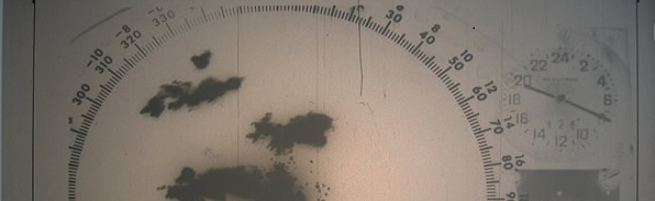

# {{wradlib}}: An Open Source Library for Weather Radar Data Processing

**Release:** {{release}}\
**Date:** {{today}}

```{toctree}
:maxdepth: 2
:hidden:
:caption: Getting Started

installation
migration
docker
ide
jupyter
```

```{toctree}
:maxdepth: 2
:hidden:
:caption: User Guide

community
notebooks/overview
reference
bibliography
weblinks
```

```{toctree}
:maxdepth: 2
:hidden:
:caption: Developers Guide

dev_guide
release_notes
```

The {{wradlib}} project has been initiated in order facilitate the use of weather radar data as well as to provide a common platform for research on new algorithms. {{wradlib}} is an open source library which is well documented and easy to use. It is written in the free programming language [Python](https://www.python.org).

:::{note}
Please cite {{wradlib}} as
*Heistermann, M., Jacobi, S., and Pfaff, T.: Technical Note: An open source library for processing weather radar data (wradlib), Hydrol. Earth Syst. Sci., 17, 863-871,* [doi:10.5194/hess-17-863-2013](https://hess.copernicus.org/articles/17/863/2013/hess-17-863-2013.pdf)

If you refer to a specific {{wradlib}} version please cite using {{wradlib}}'s zenodo [doi:10.5281/zenodo.1209843](https://doi.org/10.5281/zenodo.1209843) for this version.
:::



Weather radar data is potentially useful in meteorology, hydrology and risk management. Its ability to provide information on precipitation
with high spatio-temporal resolution over large areas makes it an invaluable tool for short term weather forecasting or flash flood forecasting.

{{wradlib}} is designed to assist you in the most important steps of processing weather radar data. These may include: reading common data formats, georeferencing, converting reflectivity to rainfall intensity, identifying and correcting typical error sources (such as clutter or attenuation) and visualising the data.

This documentation is under steady development. It provides a complete library reference as well as a set of tutorials which will get you started in working with {{wradlib}}.

:::{important}
{{wradlib}}'s documentation has been restructured. The old documentation for versions <1.19.1 are available from [here](https://docs.wradlib.org/projects/old-docs/en/1.19.0/).
:::

# License

{{wradlib}} is available under the open source [MIT License](https://opensource.org/license/mit).

# Indices and tables
- {ref}`genindex`
- {ref}`modindex`
- {ref}`search`
