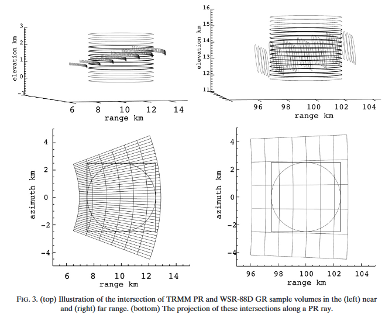

---
jupyter:
  jupytext:
    text_representation:
      extension: .md
      format_name: myst
      format_version: '1.3'
      jupytext_version: 1.17.3
---

```{raw-cell}
:tags: [hide-cell]
This notebook is part of the wradlib documentation: https://docs.wradlib.org.

Copyright (c) wradlib developers.
Distributed under the MIT License. See LICENSE.txt for more info.
```

# Match spaceborn SR (GPM/TRMM) with ground radars GR


The idea is to match ground radar (GR) and space-born radar (SR) measurements in order to create spatially and temporally coicident samples without interpolation. The procedure had been suggested by [Schwaller and Morris (2011)](https://doi.org/10.1175/2010JTECHA1403.1) and is based on the adaption by [Warren, et. al. (2017)](https://doi.org/10.1175/JTECH-D-17-0128.1).

The basic principle is illustrated in Fig. 2 of the original paper of Schwaller and Morris (2011):


*Quote Warren, et.al: "[...] In this approach, intersections between indi vidual SR beams and GR elevation sweeps are identified and the reflectivity values from both  instruments are averaged within a spatial neighborhood around the
intersection. Specifically, SR data are averaged in range over the width of the GR beam at the GR range of the intersection, while GR data are averaged in the
range–azimuth plane within the footprint of the SR beam. The result is a pair of reflectivity measurements corresponding to approximately the same volume of
atmosphere. [...]".*

This becomes clearer in Fig. 3:


Schwaller, MR, and Morris, KR. 2011. A ground validation network for the Global Precipitation Measurement mission. J. Atmos. Oceanic Technol., 28, 301-319.

Warren, R.A., A. Protat, S.T. Siems, H.A. Ramsay, V. Louf, M.J. Manton, and T.A. Kane, 0: Calibrating ground-based radars against TRMM and GPM. J. Atmos. Oceanic Technol., 0,


## Conventions

This code is based on the following conventions:

- `gr` indicates **g**round **r**adar
- `sr` indicates **s**pace-born precipitation **r**adar (TRMM or GPM)

The base routines are designed to process one GR sweep at a time. If a full GR volume with `nelev` of sweeps is available, you can iterate over each sweep. In this code, `ee` is an index that points to one of the `nelev` sweeps/elevation angles. Accordingly, a **GR** data set will be organised as an array of shape `(nelev_gr, nray_gr, ngate_gr)`.

A **SR** data set is typically organised as arrays with dimensions `(nscan_sr, nray_sr, ngate_sr)`.

```{code-cell} python
import warnings

#warnings.filterwarnings("ignore")
import wradlib as wrl
import wradlib_data
import matplotlib.pyplot as plt
import matplotlib as mpl

try:
    get_ipython().run_line_magic("matplotlib inline")
except:
    plt.ion()

import numpy as np
import datetime as dt
from osgeo import osr
import xarray as xr
import xradar as xd
```

## Acquire datafiles

```{code-cell} python
# define GPM data set
gpm_file = wradlib_data.DATASETS.fetch(
    "gpm/2A-CS-151E24S154E30S.GPM.Ku.V7-20170308.20141206-S095002-E095137.004383.V05A.HDF5"
)
# define matching ground radar file
gr2gpm_file = wradlib_data.DATASETS.fetch("hdf5/IDR66_20141206_094829.vol.h5")

# define TRMM data sets
trmm_2a23_file = wradlib_data.DATASETS.fetch(
    "trmm/2A-CS-151E24S154E30S.TRMM.PR.2A23.20100206-S111425-E111526.069662.7.HDF"
)
trmm_2a25_file = wradlib_data.DATASETS.fetch(
    "trmm/2A-CS-151E24S154E30S.TRMM.PR.2A25.20100206-S111425-E111526.069662.7.HDF"
)

# define matching ground radar file
gr2trmm_file = wradlib_data.DATASETS.fetch("hdf5/IDR66_20100206_111233.vol.h5")
```

## Set SR and GR parameters

```{code-cell} python
# Space-born precipitation radar parameters
sr_pars = {
    "trmm": {
        "zt": 402500.0,  # orbital height of TRMM (post boost)   APPROXIMATION!
        "dr": 250.0,  # gate spacing of TRMM
        "gr_file": gr2trmm_file,
    },
    "gpm": {
        "zt": 407000.0,  # orbital height of GPM                 APPROXIMATION!
        "dr": 125.0,  # gate spacing of GPM
        "gr_file": gr2gpm_file,
    },
}
```

```{code-cell} python
# Set parameters for this procedure
bw_sr = 0.71  # SR beam width
platf = "gpm"  # SR platform/product: one out of ["gpm", "trmm"]
zt = sr_pars[platf]["zt"]  # SR orbit height (meters)
dr_sr = sr_pars[platf]["dr"]  # SR gate length (meters)
gr_file = sr_pars[platf]["gr_file"]
ee = 2  # Index that points to the GR elevation angle to be used
```

## Data Input


### Ground Radar GR


#### Read GR data into datatree using xradar

The following code reads data in ODIM H5 format. If your GR data is in some other format respective adaptions are needed.

```{code-cell} python
gr_data = xd.io.open_odim_datatree(gr_file)
display(gr_data)
```

#### Extract relevant GR data and meta-data

```{code-cell} python
swp = gr_data[f"sweep_{ee}"].ds
swp = swp.set_coords("sweep_mode")
display(swp)
print(swp.sweep_fixed_angle.values)
```

#### Georeference GR (AEQD)

```{code-cell} python
swp = swp.wrl.georef.georeference()
display(swp)
```

#### Assign lonlat coords to GR

```{code-cell} python
ll = swp.wrl.georef.spherical_to_proj()
swp = swp.assign_coords(lon=ll[..., 0], lat=ll[..., 1])
display(swp)
```

#### Get GR Grid Polygons

```{code-cell} python
# todo: move to wradlib function
def get_grid_polygons(ds):
    x = ds.x
    for i in reversed(range(x.ndim)):
        x = xr.plot.utils._infer_interval_breaks(x, axis=i)
    y = ds.y
    for i in reversed(range(y.ndim)):
        y = xr.plot.utils._infer_interval_breaks(y, axis=i)
    coords = np.stack([x, y], axis=-1)
    ll = np.dstack([coords[0:-1, 0:-1], ds.z.values[..., None]])
    ul = np.dstack([coords[0:-1, 1:], ds.z.values[..., None]])
    ur = np.dstack([coords[1:, 1:], ds.z.values[..., None]])
    lr = np.dstack([coords[1:, 0:-1], ds.z.values[..., None]])
    return np.stack([ll, ul, ur, lr, ll], axis=-2)
```

```{code-cell} python
gr_poly = get_grid_polygons(swp)
```

#### Calculate GR Bounding Box

```{code-cell} python
bbox = wrl.zonalstats.get_bbox(swp.lon, swp.lat)
print(
    "Radar bounding box:\n\t%.2f\n%.2f           %.2f\n\t%.2f"
    % (bbox["top"], bbox["left"], bbox["right"], bbox["bottom"])
)
```

### Satellite data SR


#### Read GPM data

```{code-cell} python
# read spaceborn SR data
if platf == "gpm":
    sr_data = wrl.io.open_gpm_dataset(gpm_file, group="NS")
    sr_data = sr_data.set_coords(["Longitude", "Latitude"])
    sr_data = xr.decode_cf(sr_data)
    sr_data.attrs["platform"] = "GPM"
    # sr_data = wrl.io.read_gpm(gpm_file, bbox=bbox)
elif platf == "trmm":
    sr_data = wrl.io.read_trmm(trmm_2a23_file, trmm_2a25_file, bbox=bbox)
    dvars = {
        "pflag": "flagPrecip",
        "ptype": "typePrecip",
        "zbb": "heightBB",
        "bbwidth": "widthBB",
        "sfc": None,
        "quality": "qualityBB",
        "zenith": "localZenithAngle",
        "refl": "zFactorCorrected",
        "date": "time",
        "lon": "Longitude",
        "lat": "Latitude",
    }
    dims = ["nscan", "nray", "nbin"]
    data_vars = {
        dvars[k] if dvars[k] is not None else k: (dims[: v.ndim], v)
        for k, v in sr_data.items()
        if k in dvars
    }
    sr_data = xr.Dataset(data_vars=data_vars)
    # sr_data = sr_data.rename_vars(date="time")
    sr_data = sr_data.set_coords(["time", "Longitude", "Latitude"])
    sr_data["zFactorCorrected"] = sr_data["zFactorCorrected"][..., ::-1]
    sr_data["dprAlt"] = sr_pars["trmm"]["zt"]
    sr_data.attrs["platform"] = "TRMM"
else:
    raise ("Invalid platform")
display(sr_data)
```

```{code-cell} python
sr_data["dprAlt"].values
```

```{code-cell} python
# Todo: make height level parameterizable via keyword argument
# Todo: plot gr radar domain and satellite swath outlines
import cmweather


def plot_unmatched_refl(sr_data, swp, level=-5):
    """
    Plotting unmatched SR and GR Reflectivity

    # Input:
    # ------
    swp ::: graund radar sweep data
    sr_data ::: satellite data

    # Output:
    # ------
    Plot of SR Refl. and GR Refl.

    """
    plt.figure(figsize=(12, 4))
    ax1 = plt.subplot(1, 2, 1)
    # pm = sr_data.zFactorFinal[:, :, -5, 0].plot(x="Longitude", y="Latitude", cmap='jet', vmin=0, vmax=40, add_labels=False, add_colorbar=False)
    pm = sr_data.zFactorCorrected[:, :, level].plot(
        x="Longitude",
        y="Latitude",
        cmap="HomeyerRainbow",
        vmin=0,
        vmax=40,
        add_labels=False,
        add_colorbar=False,
    )
    cbar = plt.colorbar(pm, ax=ax1, ticks=np.arange(0, 42, 2))
    cbar.set_label("SR Reflectivity (dBz)", fontsize=12)
    cbar.ax.tick_params(labelsize=12)
    ax1.set_xlabel("Longitude (°)", fontsize=12)
    ax1.set_ylabel("Latitude (°)", fontsize=12)
    ax1.tick_params(axis="both", labelsize=12)
    ax1.set_title(sr_data.attrs["platform"], fontsize=12, loc="left")
    ax1.grid(lw=0.25, color="grey")
    ax1.set_xlim(sr_data.Longitude.min(), sr_data.Longitude.max())
    ax1.set_ylim(sr_data.Latitude.min(), sr_data.Latitude.max())

    ax2 = plt.subplot(1, 2, 2)
    pm = swp.DBZH.plot(
        x="lon",
        y="lat",
        vmin=0,
        vmax=40,
        ax=ax2,
        cmap="HomeyerRainbow",
        add_labels=False,
        add_colorbar=False,
    )
    cbar = plt.colorbar(pm, ax=ax2, ticks=np.arange(0, 42, 2))
    cbar.set_label("GR Reflectivity (dBz)", fontsize=12)
    cbar.ax.tick_params(labelsize=12)
    ax2.set_xlabel("Longitude (°)", fontsize=12)
    ax2.set_ylabel("Latitude (°)", fontsize=12)
    ax2.tick_params(axis="both", labelsize=12)
    ax2.set_title("Ground Radar", fontsize=12, loc="left")
    ax2.grid(lw=0.25, color="grey")
    ax2.set_xlim(sr_data.Longitude.min(), sr_data.Longitude.max())
    ax2.set_ylim(sr_data.Latitude.min(), sr_data.Latitude.max())
    plt.tight_layout()
```

```{code-cell} python
if platf == "trmm":
    level = 75
else:
    level = 171
plot_unmatched_refl(sr_data, swp, level=level)
```

#### Georeference SR data

add radar AEQD coords to the SR Dataset


##### Set fundamental georeferencing parameters

```{code-cell} python
# Todo: only keep one method

# Calculate equivalent earth radius
wgs84 = wrl.georef.get_default_projection()
# lon0_gr = gr_data.latitude.values
re1 = gr_data.ds.wrl.georef.get_earth_radius(sr=wgs84)
print("Earth radius 1:", re1)
a = wgs84.GetSemiMajor()
b = wgs84.GetSemiMinor()
print("SemiMajor, SemiMinor:", a, b)

# Set up aeqd-projection gr-centered
rad = wrl.georef.projstr_to_osr(
    ("+proj=aeqd +lon_0={lon:f} " + "+lat_0={lat:f} +a={a:f} " + "+b={b:f}").format(
        lon=gr_data.ds.longitude.values, lat=gr_data.ds.latitude.values, a=a, b=b
    )
)
re2 = gr_data.ds.wrl.georef.get_earth_radius(sr=rad)
print("Earth radius 2:", re2)
```

```{code-cell} python
# todo: use dpr altitude instead fix valued zt
```

```{code-cell} python
sr_data = sr_data.wrl.georef.reproject(
    coords=dict(x="Longitude", y="Latitude"), src_crs=wgs84, trg_crs=rad
)
sr_data
```

##### Subset relevant SR data


Calculate distance of each SR bin to the ground radar location and select only locations within the GR range.

```{code-cell} python
# calculate range and mask srdata
r = np.sqrt(sr_data.x**2 + sr_data.y**2)
sr_cut = sr_data.where(r < swp.gr.max(), drop=True)
sr_cut.zFactorCorrected[..., level].plot(x="x", y="y", vmin=-32, vmax=50)
```

##### Subset relevant SR data with precip flag

```{code-cell} python
precip_mask = xr.where(sr_cut.flagPrecip > 0, 1, 0)
precip_mask.plot(x="x", y="y")
```

##### SR Parallax Correction

Correct for parallax, get 3D-XYZ-Array

```{code-cell} python
# dr_sr = 125.
# todo: make this available from wradlib
sr_cut = sr_cut.wrl.georef.correct_parallax(dr_sr)
display(sr_cut)
```

##### Compute spherical coordinates of SR bins with regard to GR

range, azimuth, elevation

```{code-cell} python
sr_cut = sr_cut.wrl.georef.xyz_to_spherical(crs=rad)
sr_cut
```

## Compute SR and GR pulse volumes


### Calculate distance from orbit $r_s$

```{code-cell} python
bw_sr = 0.71
freq = 0
sr_cut = sr_cut.wrl.georef.dist_from_orbit(bw_sr, freq, re1)
sr_cut
```

### SR pulse volume

Todo: only keep pulse_volume method

```{code-cell} python
# # Small angle approximation
rs = sr_cut["pr_dist"]

# vol_sr2 = np.pi * dr_sr * rs**2 * np.radians(bw_sr / 2.0) ** 2

# Or using wradlib's native function
vol_sr = rs.wrl.qual.pulse_volume(dr_sr, bw_sr)
sr_cut = sr_cut.assign(vol_sr=vol_sr)
# # Evaluate difference between both approaches
# print("Min. difference (m3):", vol_sr.max(), (vol_sr - vol_sr2).min())
# print("Max. difference (m3): ", vol_sr2.max(), (vol_sr - vol_sr2).max())
# print(
#     "Average rel. difference (%):",
#     np.round(np.mean(vol_sr - vol_sr2) * 100.0 / np.mean(np.mean(vol_sr2)), 4),
# )

# Verdict: differences are negligble - use wradlibs's native function!
```

### GR pulse volume

```{code-cell} python
# GR pulse volumes
#   along one beam
# todo: check beam width
bw_gr = 1.0
vol_gr = wrl.qual.pulse_volume(swp.range, swp.range.diff("range").median(), bw_gr)
vol_gr = vol_gr.broadcast_like(swp.DBZH)
display(vol_gr)
#   with shape (nray_gr, ngate_gr)
# vol_gr = np.repeat(vol_gr, nray_gr).reshape((nray_gr, ngate_gr), order="F")
```

### Calculate horizontal and vertical dimensions $R_s$ and $D_s$ of SR bins

Select freq=0 for Ku-Band.

```{code-cell} python
freq = 0
alpha = sr_cut["localZenithAngle"].isel(nfreq=freq, missing_dims="ignore")

# Rs
sr_bin_radius = (
    0.5 * (1 + np.cos(np.radians(alpha))) * rs * np.tan(np.radians(bw_sr / 2.0))
)
sr_bin_radius.name = "sr_bin_radius"

# Ds
sr_bin_depth = dr_sr / np.cos(np.radians(alpha))
sr_bin_depth.name = "sr_bin_depth"
```

```{code-cell} python
sr_cut = sr_cut.assign(sr_bin_radius=sr_bin_radius, sr_bin_depth=sr_bin_depth)
display(sr_cut)
sr_cut.sr_bin_depth.plot()
```

## BrightBand Handling


### Median Brightband Width/Height

```{code-cell} python
# if platf == "gpm":
sr_cut = sr_cut.wrl.qual.get_bb_ratio()
display(sr_cut)
```

```{code-cell} python
sr_cut["bb_ratio"].isel(nbin=0).plot(x="x", y="y")
```

### Convert SR Ku reflectivities to S-band

Based on [Cao et.al (2013)](https://doi.org/10.1002/jgrd.50138)

```{code-cell} python
ref_sr = sr_cut.zFactorCorrected.isel(nfreq=0, missing_dims="ignore").copy()
# ref_sr = sr_data['refl'].filled(np.nan)
ref_sr_ss = xr.zeros_like(ref_sr) * np.nan
ref_sr_sh = xr.zeros_like(ref_sr) * np.nan

a_s, a_h = (wrl.trafo.KuBandToS.snow, wrl.trafo.KuBandToS.hail)
```

```{code-cell} python
# mask bb_ratio with bb_mask
ratio = sr_cut["bb_ratio"].where(sr_cut["bb_mask"])
ia = ratio >= 1
ib = ratio <= 0
im = (ratio > 0) & (ratio < 1)
ind = xr.where(im, np.round(ratio * 10), 0).astype("int")
# print(ind)
# ind = np.round(ratio[im] * 10).astype(np.int)

# ref_sr_ss = ref_sr.copy()
# ref_sr_sh = ref_sr.copy()
```

```{code-cell} python
ia
```

```{code-cell} python
fig, ((ax1, ax2), (ax3, ax4)) = plt.subplots(
    nrows=2, ncols=2, figsize=(10, 10), sharey=True, sharex=True
)
hind = 146
print(sr_cut.isel(nbin=hind).sr_range.values)
ia.isel(nbin=hind).plot(x="x", y="y", ax=ax1)
ib.isel(nbin=hind).plot(x="x", y="y", ax=ax2)
im.isel(nbin=hind).plot(x="x", y="y", ax=ax3)
ratio.isel(nbin=hind).plot(x="x", y="y", ax=ax4)
# sr_cut["bb_mask"].plot(x="x", y="y", ax=ax4)
```

```{code-cell} python
# adding ia/ib/im in sequential order to ref_sr_ss/ref_sr/sh

# above melting layer -> no mixing only snow/hail
ref_sr_ss = xr.where(
    ia, ref_sr + wrl.util.calculate_polynomial(ref_sr.copy(), a_s[:, 10]), ref_sr_ss
)
ref_sr_sh = xr.where(
    ia, ref_sr + wrl.util.calculate_polynomial(ref_sr.copy(), a_h[:, 10]), ref_sr_sh
)
fig, (ax1, ax2, ax3) = plt.subplots(nrows=1, ncols=3, figsize=(15, 4), sharey=True)
ref_sr_ss.isel(nbin=hind).plot(x="x", y="y", ax=ax1)
ref_sr_sh.isel(nbin=hind).plot(x="x", y="y", ax=ax2)
(ref_sr_ss - ref_sr_sh).isel(nbin=hind).plot(x="x", y="y", ax=ax3)
```

```{code-cell} python
# below the melting layer
ref_sr_ss = xr.where(
    ib, ref_sr + wrl.util.calculate_polynomial(ref_sr.copy(), a_s[:, 0]), ref_sr_ss
)
ref_sr_sh = xr.where(
    ib, ref_sr + wrl.util.calculate_polynomial(ref_sr.copy(), a_h[:, 0]), ref_sr_sh
)
fig, (ax1, ax2, ax3) = plt.subplots(nrows=1, ncols=3, figsize=(15, 4), sharey=True)
ref_sr_ss.isel(nbin=hind).plot(x="x", y="y", ax=ax1)
ref_sr_sh.isel(nbin=hind).plot(x="x", y="y", ax=ax2)
(ref_sr_ss - ref_sr_sh).isel(nbin=hind).plot(x="x", y="y", ax=ax3)
```

```{code-cell} python
# inside melting layer
ref_sr_ss = xr.where(
    im, ref_sr + wrl.util.calculate_polynomial(ref_sr.copy(), a_s[:, ind]), ref_sr_ss
)
ref_sr_sh = xr.where(
    im, ref_sr + wrl.util.calculate_polynomial(ref_sr.copy(), a_h[:, ind]), ref_sr_sh
)
fig, (ax1, ax2, ax3) = plt.subplots(nrows=1, ncols=3, figsize=(15, 4), sharey=True)
ref_sr_ss.isel(nbin=hind).plot(x="x", y="y", ax=ax1)
ref_sr_sh.isel(nbin=hind).plot(x="x", y="y", ax=ax2)
(ref_sr_ss - ref_sr_sh).isel(nbin=hind).plot(x="x", y="y", ax=ax3)
```

```{code-cell} python
# Jackson Tan's fix for C-band
# if gr_radar_band == 'C':
#     print('SR reflectivity is converted to C-band')
#     deltas = (ref_sr_ss - ref_sr) * 5.3 / 10.0
#     ref_sr_ss = ref_sr + deltas
#     deltah = (ref_sr_sh - ref_sr) * 5.3 / 10.0
#     ref_sr_sh = ref_sr + deltah
# gr_radar_band = "S"
# if gr_radar_band == 'X':
#     print('SR reflectivity is converted to X-band')
#     deltas = (ref_sr_ss - ref_sr) * 3.2 / 10.0
#     ref_sr_ss = ref_sr + deltas
#     deltah = (ref_sr_sh - ref_sr) * 3.2 / 10.0
#     ref_sr_sh = ref_sr + deltah

# ref_sr_ss = ref_sr_ss.where(ref_sr >= 0)
# ref_sr_sh = ref_sr_sh.where(ref_sr >= 0)
```

```{code-cell} python
if platf == "gpm":
    ptype = (sr_cut.typePrecip / 1e7).astype(np.int16)
else:
    ptype = sr_cut.typePrecip
display(ptype)
ptype.plot(x="x", y="y")
```

```{code-cell} python
# Combined conversion
ref_sr_com = xr.zeros_like(ref_sr_ss) * np.nan
ref_sr_com = xr.where(ptype == 1, ref_sr_ss, ref_sr_com)
ref_sr_com = xr.where(ptype == 2, ref_sr_sh, ref_sr_com)
ref_sr_com.isel(nbin=hind).plot(x="x", y="y", vmin=0, vmax=50)
```

```{code-cell} python
sr_cut = sr_cut.assign(ref_sr_com=ref_sr_com, ref_sr_ss=ref_sr_ss, ref_sr_sh=ref_sr_sh)
display(sr_cut)
```

### Convert S-band GR reflectivities to Ku-band

Using the method of [Liao and Meneghini (2009)](https://doi.org/10.1175/2008JAMC1974.1)

```{code-cell} python
ref_gr = swp["DBZH"].copy()

# Convert S-band GR reflectivities to Ku-band using method of Liao and Meneghini (2009)
ref_gr2sr = np.zeros_like(ref_gr) * np.nan

# Which zbb value should we take here???
#    Q'n'Dirty: just take the mean of all SR profiles
#    TODO: Consider zbb for each profile during the matching process

zbb = sr_cut["heightBB"]

# Snow
ia = swp.z >= np.nanmean(zbb)
ref_gr2sr = xr.where(
    ia, wrl.util.calculate_polynomial(ref_gr, wrl.trafo.SBandToKu.snow), ref_gr2sr
)
# Rain
ib = swp.z < np.nanmean(zbb)
ref_gr2sr = xr.where(
    ib, wrl.util.calculate_polynomial(ref_gr, wrl.trafo.SBandToKu.rain), ref_gr2sr
)

# # Jackson Tan's fix for C-band
# is_cband = False
# if is_cband:
#     delta = (ref_gr_ku - ref_gr) * 3.2 / 10.0
#     ref_gr_ku = ref_gr + delta
```

```{code-cell} python
display(ref_gr2sr)
```

```{code-cell} python
fig = plt.figure(figsize=(8, 6))
ax1 = fig.add_subplot(111)
ref_gr2sr.plot(x="x", y="y", ax=ax1, cmap="turbo", vmin=0, vmax=50)
```

## Matching SR/GR


### Identify which SR rays actually intersect with the GR sweep

Based on the above criteria (in radar range, precipitating SR profile) and based on SR elevation angle (with regard to GR).

This will only keep the wanted value in sr_match.

- sr_cut contains all satellite reflectivities we need. ref_sr_ss, ref_sr_sh, ref_sr_com, zFactorCorrected.

```{code-cell} python
sr_match = sr_cut.reset_coords(["xp", "yp", "zp"])
sr_match = sr_match.where(precip_mask).where(
    (sr_match.elevation >= (swp.sweep_fixed_angle - bw_gr / 2.0))
    & (sr_match.elevation <= (swp.sweep_fixed_angle + bw_gr / 2.0))
)
```

```{code-cell} python
# calculate nbeams
sr_match_mean = sr_match.mean("nbin")
xyzp_sr = xr.concat(
    [sr_match_mean.xp, sr_match_mean.yp, sr_match_mean.zp], dim="ncoord"
).transpose(..., "ncoord")
xyzp_sr = (
    xyzp_sr.stack(nbeams=("nscan", "nray"))
    .transpose("nbeams", "ncoord", ...)
    .dropna(
        dim="nbeams",
    )
)
nbeams = xyzp_sr.nbeams
nbeams
```

```{code-cell} python
xyzp_sr
```

## New version matching

```{code-cell} python
sr_match2 = sr_match.stack(nbeams=("nscan", "nray")).where(nbeams)
display(sr_match2)
```

```{code-cell} python
# mean along nbin
sr_match_mean = sr_match.mean(dim="nbin")
sr_match2_mean = sr_match2.mean(dim="nbin")
sr_match_mean.zFactorCorrected.plot(x="x", y="y", cmap="turbo", vmin=0, vmax=40)
plt.figure()
plt.scatter(
    sr_match2_mean.x.values,
    sr_match2_mean.y.values,
    c=sr_match2_mean.zFactorCorrected.values,
    s=30,
    cmap="turbo",
    vmin=0,
    vmax=40,
)
plt.gca().set_xlabel("x")
plt.gca().set_ylabel("y")
plt.colorbar(label="zFactorCorrected")
```

```{code-cell} python
# max along nbin, approximate Rs
sr_match_max = sr_match.max(dim="nbin")
sr_match2_max = sr_match2.max(dim="nbin")
sr_match_max.sr_bin_radius.plot(x="x", y="y", cmap="turbo")
plt.figure()
plt.scatter(
    sr_match2_max.x.values,
    sr_match2_max.y.values,
    c=sr_match2_max.sr_bin_radius.values,
    s=30,
    cmap="turbo",
)
plt.gca().set_xlabel("x")
plt.gca().set_ylabel("y")
plt.colorbar(label="sr_bin_radius")
```

```{code-cell} python
# sum along nbin
# approximate Ds and Vs
sr_match_sum = sr_match.sum(dim="nbin", skipna=True)
sr_match2_sum = sr_match2.sum(dim="nbin", skipna=True)
display(sr_match_sum)
sr_match_sum.sr_bin_depth.plot(x="x", y="y", cmap="turbo")
plt.figure()
plt.scatter(
    sr_match2_sum.x.values,
    sr_match2_sum.y.values,
    c=sr_match2_sum.sr_bin_depth.values,
    s=30,
    cmap="turbo",
)
plt.gca().set_xlabel("x")
plt.gca().set_ylabel("y")
plt.colorbar(label="sr_bin_depth")
```

```{code-cell} python
sr_match_sum.vol_sr.plot(x="x", y="y", cmap="turbo")
plt.figure()
plt.scatter(
    sr_match2_sum.x.values,
    sr_match2_sum.y.values,
    c=sr_match2_sum.vol_sr.values,
    s=30,
    cmap="turbo",
)
plt.gca().set_xlabel("x")
plt.gca().set_ylabel("y")
plt.colorbar(label="vol_sr")
```

### Identify which GR bins actually intersect with the SR footprint

```{code-cell} python
sr_match2_mean
```

```{code-cell} python
%%time
## Create Zonal Data Source of matching SR profiles
xyp_sr = np.stack([sr_match2_mean.xp, sr_match2_mean.yp], axis=-1)
zds = wrl.io.VectorSource(xyp_sr, trg_crs=rad)
```

```{code-cell} python
%%time
## Create SR beam polygons using sr_bin_radius Rs
tmp_trg_lyr = zds.ds.GetLayer()
trg_poly = []
for i, feat in enumerate(tmp_trg_lyr):
    geom = feat.GetGeometryRef().Buffer(sr_match2_max.sr_bin_radius.values[i])
    poly = wrl.georef.ogr_to_numpy(geom)
    trg_poly.append(poly)
```

```{code-cell} python
gr_poly.shape
```

```{code-cell} python
%%time
## Create ZonalDataPoly for GR and SR profiles
print("Create ZonalDataPoly for GR and SR profiles.")
print("This process can take a few seconds... ")

zdp = wrl.zonalstats.ZonalDataPoly(
    gr_poly[..., 0:2].reshape(-1, 5, 2), trg=trg_poly, crs=rad
)
```

```{code-cell} python
%%time
# dump zonal data
zdp.dump_vector("m3d_zonal_poly_{0}".format(platf))
```

```{code-cell} python
# %%time
print("loading")
obj3 = wrl.zonalstats.ZonalStatsPoly("m3d_zonal_poly_{0}".format(platf))
```

```{code-cell} python
## Average GR volume and reflectivity
volgr1 = np.array(
    [
        np.sum(vol_gr.values.ravel()[obj3.ix[i]])
        for i in np.arange(len(obj3.ix))[~obj3.check_empty()]
    ]
)
```

### SR Reflectivity matched

```{code-cell} python
# converted for stratiform
ref_sr2gr_m = sr_match2.ref_sr_com.copy()
ref_sr2gr_m = wrl.trafo.idecibel(ref_sr2gr_m)
ref_sr2gr_m = ref_sr2gr_m.mean(dim="nbin", skipna=True)
ref_sr2gr_m = wrl.trafo.decibel(ref_sr2gr_m)
display(ref_sr2gr_m)
```

```{code-cell} python
ref_sr_m = wrl.trafo.idecibel(sr_match2.zFactorCorrected)
ref_sr_m = ref_sr_m.mean(dim="nbin", skipna=True)
ref_sr_m = wrl.trafo.decibel(ref_sr_m)
display(ref_sr_m)
```

```{code-cell} python
def plot_matched_refl(sr_data, gr_data, xyz):
    """
    Plotting unmatched SR and GR Reflectivity

    # Input:
    # ------
    gr_data ::: graund radar sweep data
    sr_data ::: satellite data

    # Output:
    # ------
    Plot of SR Refl. and GR Refl.

    """
    plt.figure(figsize=(12, 4))
    plt.subplot(1, 2, 1)
    plt.scatter(
        xyz[..., 0],
        xyz[..., 1],
        c=sr_data.data,
        s=10,
        cmap="turbo",
        vmin=0,
        vmax=40,
    )
    cbar = plt.colorbar(ticks=np.arange(0, 42, 2))
    cbar.set_label("SR Reflectivity (dBz)", fontsize=12)
    cbar.ax.tick_params(labelsize=12)
    plt.xlabel("Longitude (°)", fontsize=12)
    plt.ylabel("Latitude (°)", fontsize=12)
    a = plt.xticks(fontsize=12)
    a = plt.yticks(fontsize=12)
    plt.title("Satellite Radar", fontsize=12, loc="left")

    plt.grid(lw=0.25, color="grey")

    plt.subplot(1, 2, 2)
    plt.scatter(
        xyz[..., 0], xyz[..., 1], c=gr_data, s=10, cmap="turbo", vmin=0, vmax=40
    )
    cbar = plt.colorbar(ticks=np.arange(0, 42, 2))
    cbar.set_label("GR Reflectivity (dBz)", fontsize=12)
    cbar.ax.tick_params(labelsize=12)
    plt.xlabel("x (km)", fontsize=12)
    plt.ylabel("y (km)", fontsize=12)
    a = plt.xticks(fontsize=12)
    a = plt.yticks(fontsize=12)
    plt.title("Ground Radar", fontsize=12, loc="left")
    plt.grid(lw=0.25, color="grey")
    plt.tight_layout()
```

### Ground Radar Reflectivity matched

```{code-cell} python
mean = obj3.mean(wrl.trafo.idecibel(swp.DBZH).values.ravel())
obj3.zdata.trg.geo["mean"] = wrl.trafo.decibel(mean)
ref_gr_m = obj3.zdata.trg.geo["mean"]
```

```{code-cell} python
mean = obj3.mean(wrl.trafo.idecibel(ref_gr2sr).values.ravel())
obj3.zdata.trg.geo["mean"] = wrl.trafo.decibel(mean)
ref_gr2sr_m = obj3.zdata.trg.geo["mean"]
```

```{code-cell} python
# todo: title fig.suptitle("GR vs SR (to_gr)") etc
```

```{code-cell} python
plot_matched_refl(ref_sr2gr_m, ref_gr_m, xyp_sr)
plt.suptitle("GR vs SR (to_gr)")
```

```{code-cell} python
plot_matched_refl(ref_sr_m, ref_gr2sr_m, xyp_sr)
plt.suptitle("GR (to_sr) vs SR")
```

### Diagnostic Plots

```{code-cell} python
volcol = sr_match2_sum.vol_sr
```

```{code-cell} python
fig = plt.figure(figsize=(12, 5))
ax = fig.add_subplot(121, aspect="equal")
plt.scatter(
    ref_gr_m.values, ref_sr2gr_m.values.ravel(), marker="+", c=volcol, cmap="turbo"
)
plt.colorbar(label="Matching Volume [m³]")
plt.plot([0, 60], [0, 60], linestyle="solid", color="black")
plt.xlim(10, 50)
plt.ylim(10, 50)
plt.xlabel("GR reflectivity (dBZ)")
plt.ylabel("SR reflectivity (dBZ)")
plt.title(f"Offset GR-SR: {np.nanmedian(ref_gr_m.values - ref_sr2gr_m.values.ravel())}")
ax = fig.add_subplot(122)
plt.hist(
    ref_gr_m[ref_gr_m > 10], bins=np.arange(-10, 50, 5), edgecolor="None", label="GR"
)
plt.hist(
    ref_sr2gr_m[ref_sr2gr_m > -10],
    bins=np.arange(-10, 50, 5),
    edgecolor="red",
    facecolor="None",
    label="SR",
)
plt.xlabel("Reflectivity (dBZ)")
plt.legend()
fig.suptitle("GR vs SR (to_gr)")
```

```{code-cell} python
fig = plt.figure(figsize=(12, 5))
ax = fig.add_subplot(121, aspect="equal")
plt.scatter(ref_gr2sr_m, ref_sr_m, marker="+", c=volcol, cmap="turbo")
plt.colorbar(label="Matching Volume [m³]")
plt.plot([0, 60], [0, 60], linestyle="solid", color="black")
plt.xlim(10, 50)
plt.ylim(10, 50)
plt.xlabel("GR reflectivity (dBZ)")
plt.ylabel("SR reflectivity (dBZ)")
plt.title(f"Offset GR-SR: {np.nanmedian(ref_gr2sr_m.values - ref_sr_m.values.ravel())}")
ax = fig.add_subplot(122)
plt.hist(
    ref_gr2sr_m[ref_gr2sr_m > 10],
    bins=np.arange(-10, 50, 5),
    edgecolor="None",
    label="GR",
)
plt.hist(
    ref_sr_m[ref_sr_m > -10],
    bins=np.arange(-10, 50, 5),
    edgecolor="red",
    facecolor="None",
    label="SR",
)
plt.xlabel("Reflectivity (dBZ)")
plt.legend()
fig.suptitle("GR (to_sr) vs SR")
```
